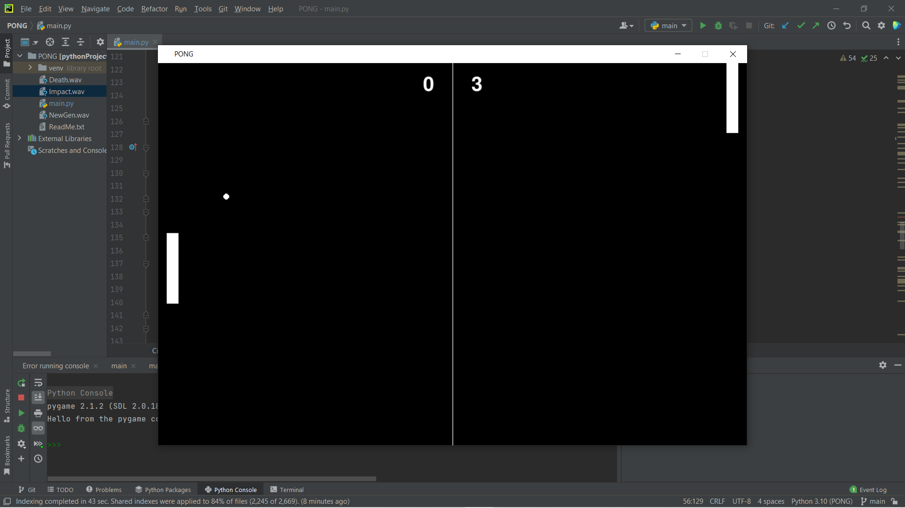

# Pygame Pong Game

This is a simple implementation of the classic Pong game using the Pygame library in Python. Players control paddles using mouse input to bounce a ball back and forth between them and the computer-controlled opponent.



## Getting Started

### Prerequisites

To run the game, you need to have Python and the Pygame library installed on your system.

- Python 3.x: [Download Python](https://www.python.org/downloads/)
- Pygame: You can install Pygame using pip with the following command:

```bash
pip install pygame
```
### Prerequisites
- Pong: You can run the game using the following command:
```bash
python3 main.py
```